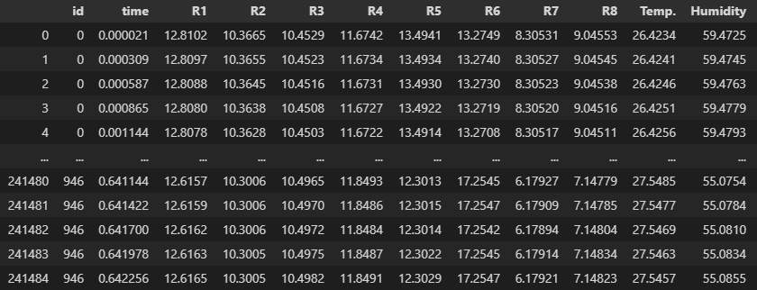

# SMTS Implementation
- Continuous implementation of Baydogan's SMTS described in ``Learning a symbolic representation for multivariate time series classification``.
- This repo doesn't accept categorical attributes.

## SMTS Prerequisites
- This implementation requires a flat dataset with the series identificators in order to determine each sample's origin. 
  - E.g:

    
    
## TODO
- Investigar la clase [SimpleImputer de SkLearn](https://scikit-learn.org/stable/modules/generated/sklearn.impute.SimpleImputer.html)
  - Para interpolar, sustituir por constantes, ... missing values.
  - Puede ser interesante para tratar series de diferente resolución en un mismo modelo (a no ser que tengamos un modelo que permite Missing Values).
- Permitir Missing Values utilizando una implementación de Random Forest que lo contemple (SkLearn no permite Missing Values en sus modelos).
  - A ser posible que sea paralelizable (para mejorar la escalabilidad).